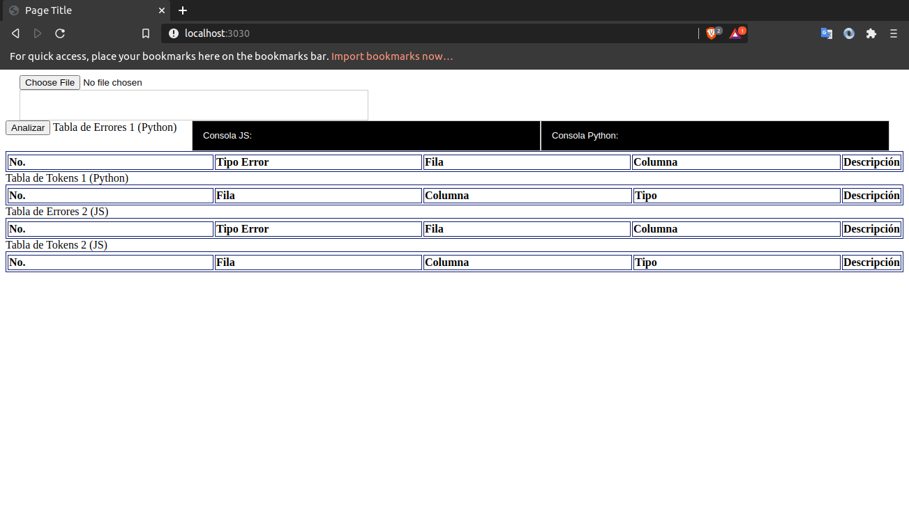
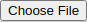
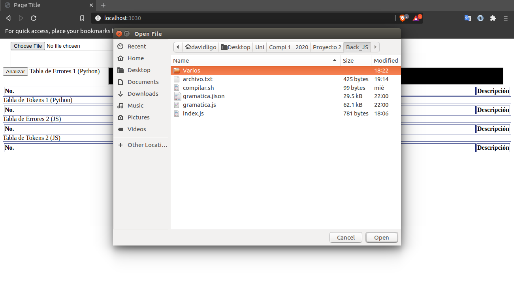
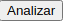
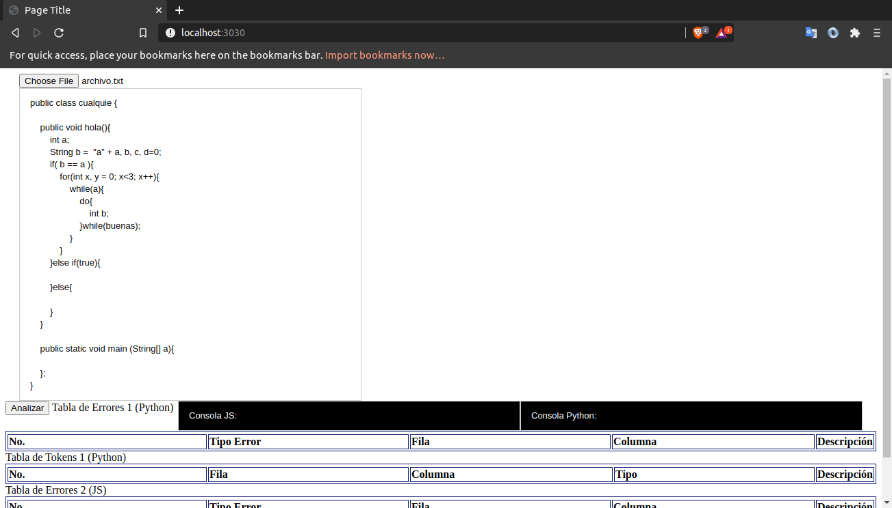
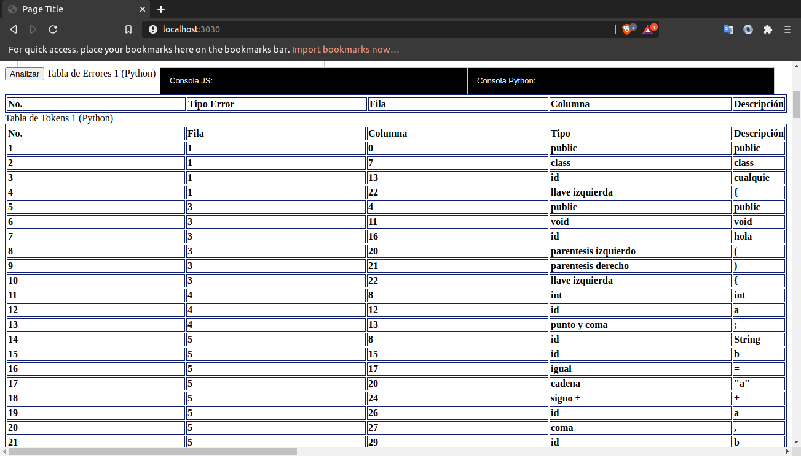
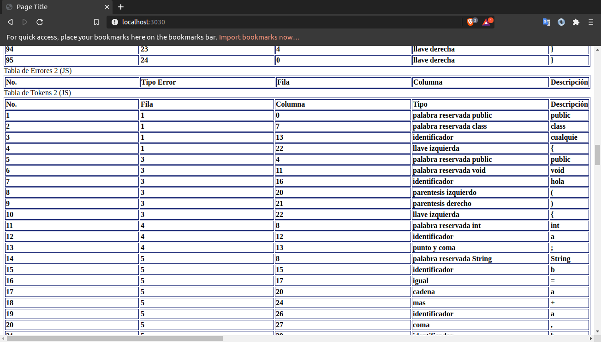
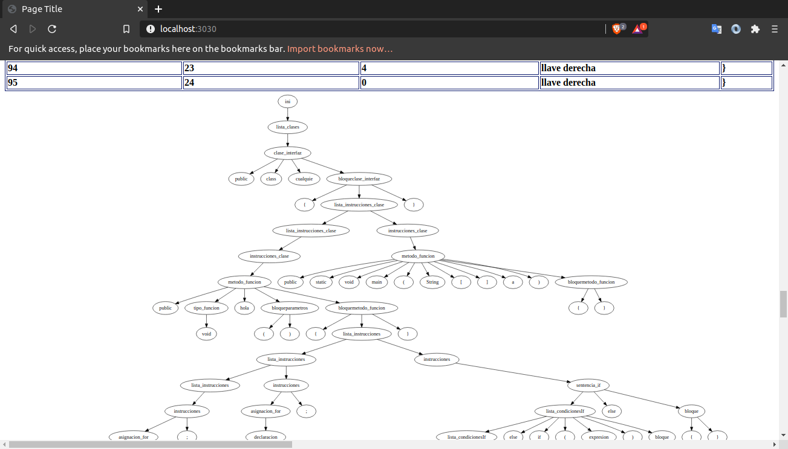

# OLC1 Proyecto2 201314850
## Pequeño manual de Usuario
* Inico de Programa
    
    Al la pagina web nos muestra el siguiente contenido, donde podemos:
    * Cargar un archivo
    * También se puede escribir el código a mano o editarlo para su análisis.

    

* Cargando Archivo
    
    * Seleccionamos el botón de "Choose File" en la esquina superior izquierda. 

        Nos aparece un explorador de archivos para seleccionar el archivo deseado.

    

    * Una vez cargado el archivo se procede a seleccionar el botón de "Analizar" para realizar el análisis. 

    

* Tablas Tokens y Errores
    
    * Nos mostrará los reportes de errores y la lista de Tokens obtenidos durante el analisis.

    
    

* Árbol de Análisis Sintáctico

    * Y por último al final de la página nos mostrara el Graphviz del árbol de análisis sintáctico obtenido del análisis.

    